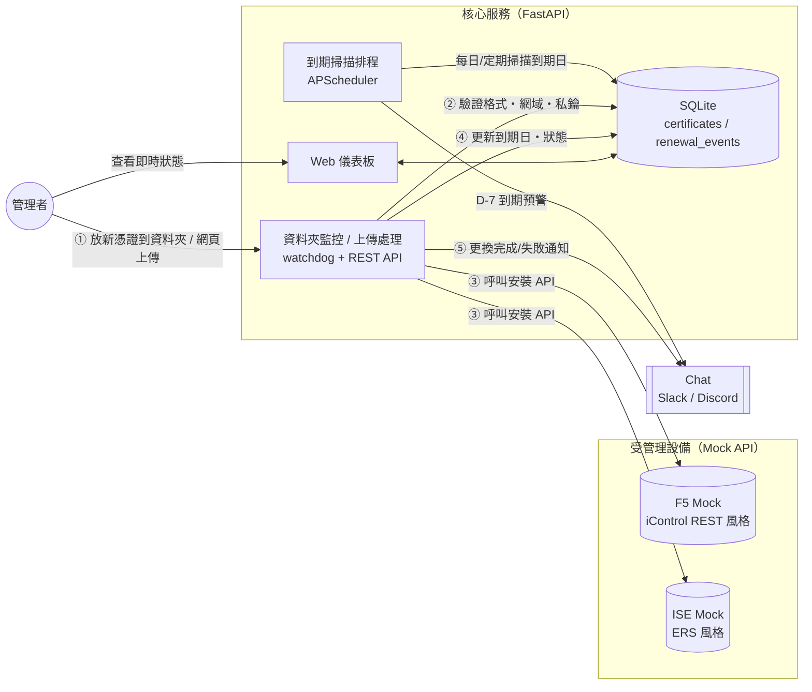
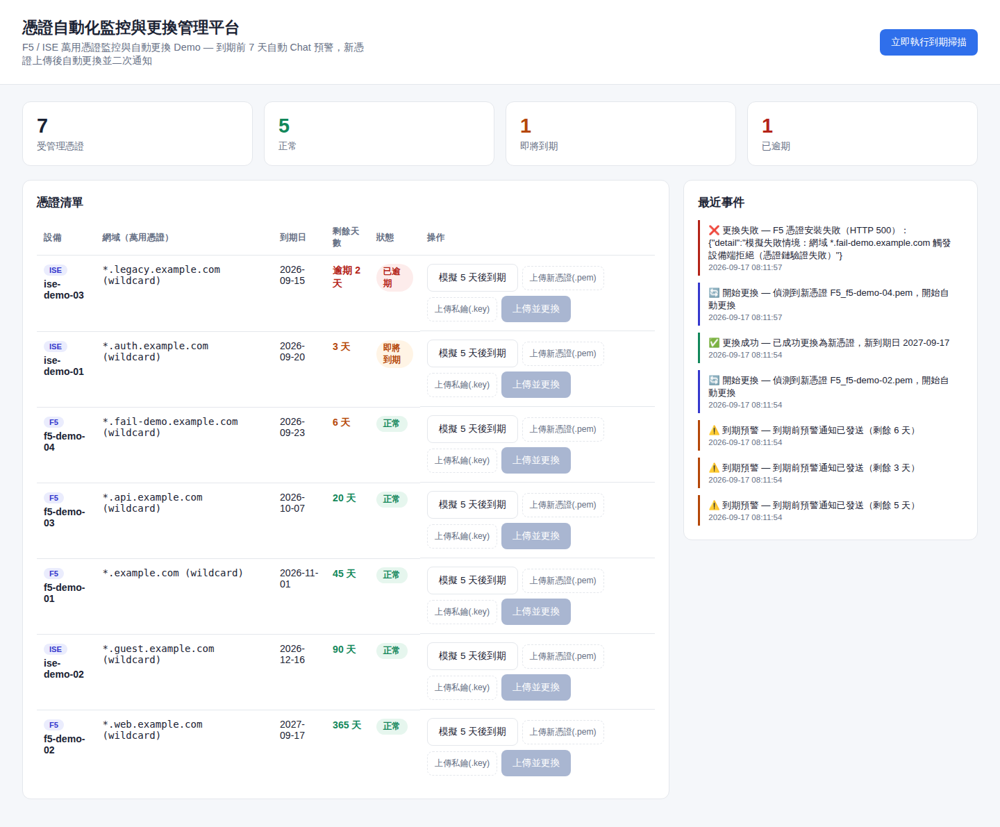

# 憑證自動化監控與更換管理平台

**Certificate Lifecycle Automation for F5 / Cisco ISE Wildcard Certificates** — a self-contained demo (mock device APIs included) of an end-to-end pipeline: expiry monitoring → D-7 chat alert → admin drops in the renewed cert → API auto-install → completion alert.


---

## 🌐 線上 Demo

**[https://cert-lifecycle-manager.onrender.com](https://cert-lifecycle-manager.onrender.com)** — 免安裝、點開即可操作

- 上方「重置示範資料」可隨時把資料還原成初始狀態（這是公開共用的示範環境）
- 免費方案閒置約 15 分鐘會休眠，若第一次打開等了 30–50 秒才有反應是正常現象，稍等即可
- 通知預設走 console log（不會真的發到任何 Slack/Discord 頻道）；本機執行時可設定真實 Webhook，見下方「環境變數」

---

## 專案簡介

F5、ISE 上的萬用憑證（Wildcard Certificate）到期時間過去多半靠人工追蹤，容易因為疏忽或跨單位溝通延遲，導致憑證逾期未更換而造成服務中斷。本專案是這套自動化機制的**可執行 Demo**：

1. **監控**：排程掃描每張受管理憑證的到期日
2. **預警**：到期前 7 天自動透過 Slack / Discord 通知管理者
3. **交付**：管理者取得新憑證後，放入指定資料夾（或直接從儀表板上傳）
4. **自動更換**：服務監控資料夾，驗證憑證後呼叫設備 API（F5 iControl REST / ISE ERS 風格）自動安裝
5. **完成通知**：更換成功或失敗都會再次透過 Chat 通知，失敗時保留原憑證、不中斷服務

因為手上沒有真的 F5 / ISE 設備，這個 repo 用兩個小型 FastAPI 服務**模擬**了它們的憑證安裝 API（見 `mock_devices/`），所以整個流程不需要任何真實硬體就能完整跑起來、也方便在面試或展示時當場操作。

📄 這個 Demo 是從一份完整的專案企劃（目標表、9 週時程表、風險管控清單）落地實作的其中一部分。

---

## 核心功能

- 憑證到期集中監控，儀表板即時顯示剩餘天數與狀態（正常 / 即將到期 / 已逾期 / 更換中）
- 到期前 N 天（可設定）自動發送 Slack / Discord 通知，同一天內不重複發送
- 資料夾監控（`watchdog`）與網頁上傳兩種方式皆可觸發自動更換，共用同一套驗證與安裝邏輯
- 憑證安裝前自動驗證檔案格式、私鑰是否齊全、網域是否與受管理憑證相符，避免誤置憑證
- 更換失敗時保留原憑證（不 rollback 覆蓋成功狀態）、記錄失敗原因、即時告警
- 每一次預警 / 更換都留有稽核紀錄（`renewal_events`），儀表板右側即時事件流
- 內建「模擬到期」「模擬失敗」按鈕，Demo 時不必真的等 7 天

---

## 系統架構



---

## 畫面截圖



儀表板同時展示了：4 種狀態的憑證、一次成功更換（`f5-demo-02`）與一次刻意觸發的失敗案例（`f5-demo-04`，用來示範失敗告警與稽核紀錄）。

---

## 技術棧

| 項目 | 選擇 | 說明 |
|---|---|---|
| 後端框架 | FastAPI | REST API + Jinja2 儀表板 |
| ORM / DB | SQLAlchemy + SQLite | 示範用途，正式環境建議換 PostgreSQL |
| 排程 | APScheduler | 到期掃描（背景執行緒） |
| 資料夾監控 | watchdog | 監看 `data/certs_incoming/` |
| 憑證處理 | cryptography | 產生 / 解析 X.509 憑證 |
| Chat 通知 | Slack / Discord Incoming Webhook | 未設定時自動退回 console log |
| 容器化 | Docker Compose | app + 2 個 mock 設備服務 |
| 測試 | pytest | 涵蓋成功 / 失敗 / 網域不符三種路徑 |
| CI | GitHub Actions | push / PR 自動跑測試 |

---

## 快速開始

### 方法一：Docker Compose（推薦）

```bash
git clone https://github.com/s9828027-hue/cert-lifecycle-manager.git
cd cert-lifecycle-manager
cp .env.example .env        # 預設 CHAT_PROVIDER=console，不需 webhook 也能跑
docker compose up --build
```

啟動後：

- 儀表板：http://localhost:8000
- Mock F5 API：http://localhost:9001/docs
- Mock ISE API：http://localhost:9002/docs

另開一個終端機灌入示範資料：

```bash
docker compose exec app python scripts/seed_demo.py --reset
```

### 方法二：本機 Python 環境

```bash
python3 -m venv .venv && source .venv/bin/activate
pip install -r requirements.txt
cp .env.example .env

# 三個服務各開一個終端機
uvicorn mock_devices.f5_mock:app --port 9001
uvicorn mock_devices.ise_mock:app --port 9002
uvicorn app.main:app --port 8000

# 灌入示範資料
python scripts/seed_demo.py --reset
```

### 接上真實 Slack / Discord 通知

在 `.env` 設定：

```bash
CHAT_PROVIDER=slack          # 或 discord
SLACK_WEBHOOK_URL=https://hooks.slack.com/services/xxx/yyy/zzz
```

Slack / Discord 都可以免費申請一組 Incoming Webhook URL 做測試。

---

## Demo 操作流程

跑完「快速開始」並 `seed_demo.py` 之後，建議照這個順序操作，五分鐘內可以展示完整流程：

1. 打開 http://localhost:8000 ，可以看到 7 筆示範憑證，已有 3 筆在 7 天預警範圍內（seed 資料就刻意這樣設計）
2. 點任一筆憑證的「立即執行到期掃描」或等排程自動跑，觀察右側事件流出現「⚠️ 到期預警」，並在服務 log（或 Slack/Discord）看到通知內容
3. 模擬管理者拿到新憑證並更換：
   ```bash
   python scripts/generate_sample_cert.py --device-type F5 --device-name f5-demo-02 --domain "*.web.example.com"
   ```
   幾秒內儀表板該列狀態會變成「正常」、到期日更新、事件流出現「✅ 更換成功」
4. 或直接在儀表板該列用「上傳新憑證(.pem)」「上傳私鑰(.key)」+「上傳並更換」按鈕，效果相同（不用碰終端機）
5. 示範失敗與風控機制：
   ```bash
   python scripts/generate_sample_cert.py --device-type F5 --device-name f5-demo-04 --domain "*.fail-demo.example.com"
   ```
   Mock 設備會刻意拒絕這個網域，事件流出現「❌ 更換失敗」且**原憑證到期日不會被覆蓋**——示範「更換失敗不中斷服務」的設計

---

## 專案結構

```
cert-lifecycle-manager/
├── app/
│   ├── main.py           # FastAPI 進入點（掛載排程 / 監控 / 路由）
│   ├── config.py         # 所有可調參數集中管理
│   ├── models.py         # Certificate / RenewalEvent
│   ├── cert_utils.py      # X.509 憑證產生與解析
│   ├── notifier.py        # Slack / Discord / console 通知
│   ├── scheduler.py       # D-7 到期掃描排程
│   ├── watcher.py         # 資料夾監控 + 上傳共用的核心處理邏輯
│   ├── devices/            # F5 / ISE API client（換真實設備只需改這裡）
│   ├── routers/            # REST API + 儀表板路由
│   ├── templates/          # 儀表板 HTML
│   └── static/              # 儀表板 CSS / JS
├── mock_devices/            # 模擬 F5 / ISE 管理 API
├── scripts/
│   ├── seed_demo.py         # 灌入示範資料
│   └── generate_sample_cert.py  # 產生新憑證丟進資料夾（觸發更換）
├── tests/                    # pytest（成功 / 失敗 / 網域不符路徑）
├── docker-compose.yml
└── docs/screenshots/
```

---

## 風險管控設計

這個 Demo 對應的原始專案企劃書中訂有風險管控清單，程式碼中對應的實作位置：

| 風險項目 | 對應機制 |
|---|---|
| 憑證誤置或格式錯誤 | `watcher.py` 安裝前驗證格式、網域、私鑰是否齊全，不符合直接拒絕並歸檔到 `_rejected/` |
| 自動更換失敗未即時發現 | 失敗時立即發送 Chat 告警，且**不覆蓋原憑證到期日**（見 `test_watcher.py::test_failed_device_install_...`） |
| Chat 通知服務中斷 | `notifier.py` 找不到 webhook 或發送失敗時自動退回 console log，不會讓例外中斷主流程 |
| API 帳號權限過大 | `devices/` 中的 client 僅呼叫憑證安裝端點，token 與 base URL 皆可獨立設定，方便套最小權限原則 |
| 監控或更換系統本身故障 | APScheduler + watchdog 各自獨立執行緒，任一元件的例外都不會讓 FastAPI 主程序掛掉 |

---

## 測試

```bash
pytest -q
```

目前涵蓋：憑證產生/解析往返正確性、Chat 訊息格式化、以及更換流程的三條路徑（成功、設備拒絕、網域不符）。`.github/workflows/ci.yml` 會在每次 push / PR 自動執行。

---

## 這是 Demo，不是正式環境——如果要落地還需要

- F5 / ISE 換成真實 mTLS 憑證管理 API，並加上憑證釘選（certificate pinning）
- API 帳號密碼 / token 改用密鑰管理服務（Vault、AWS Secrets Manager 等），不落地在 `.env`
- SQLite 換成正式資料庫，並加上多副本高可用（排程 leader election，避免多副本重複通知）
- 資料夾監控在正式環境建議改為 SFTP / 內部 API 上傳並加上來源身分驗證，而非單純檔案系統事件
- 憑證與私鑰傳輸與落地儲存需加密（目前 Demo 為求簡單以明碼 PEM 檔示範）
- 加上角色權限控管（RBAC）與操作稽核紀錄的存取控制

---

## 授權

MIT License
